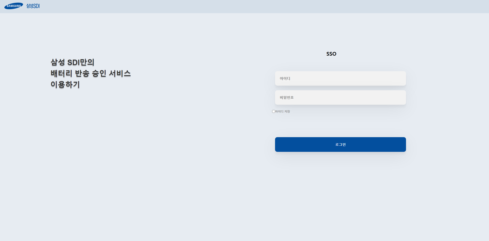
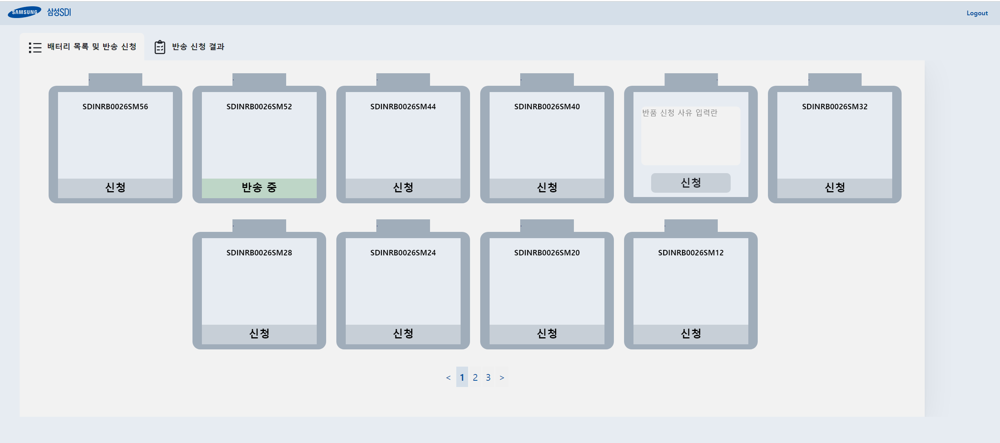
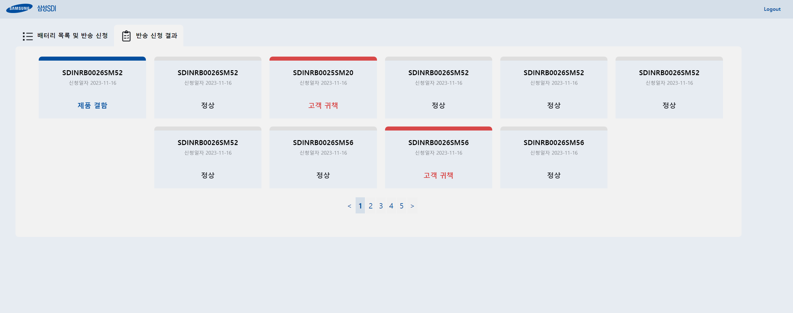
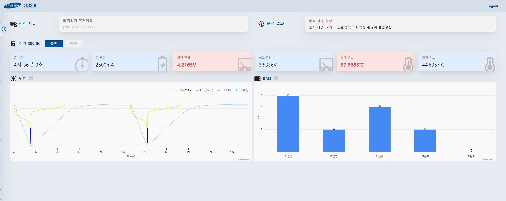
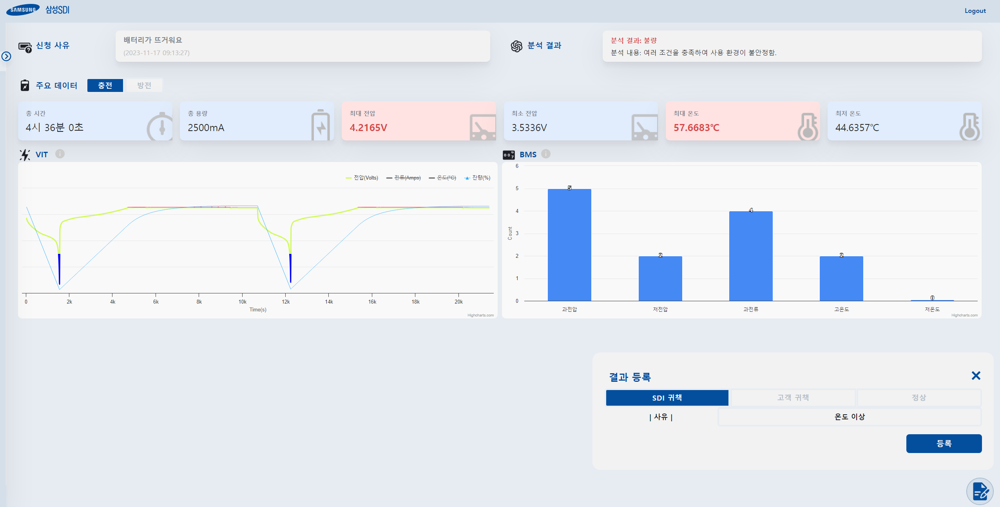
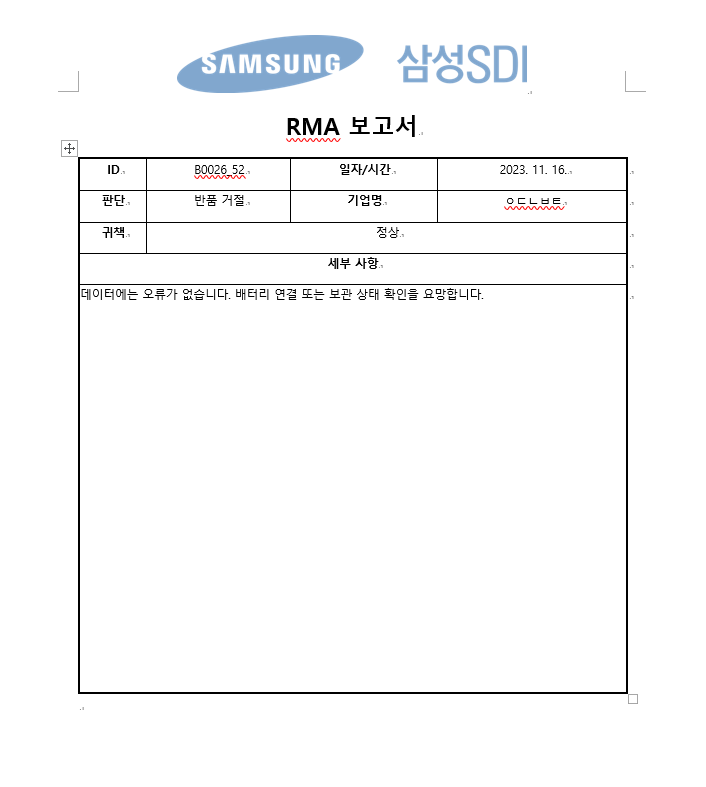
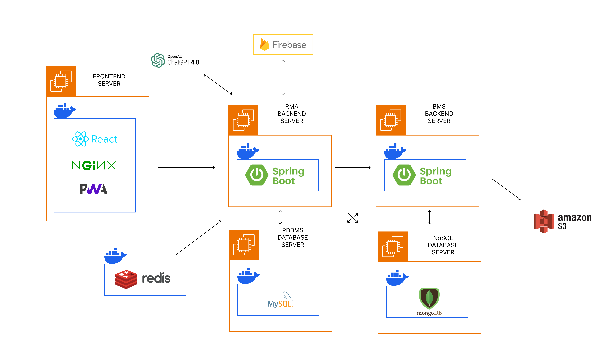
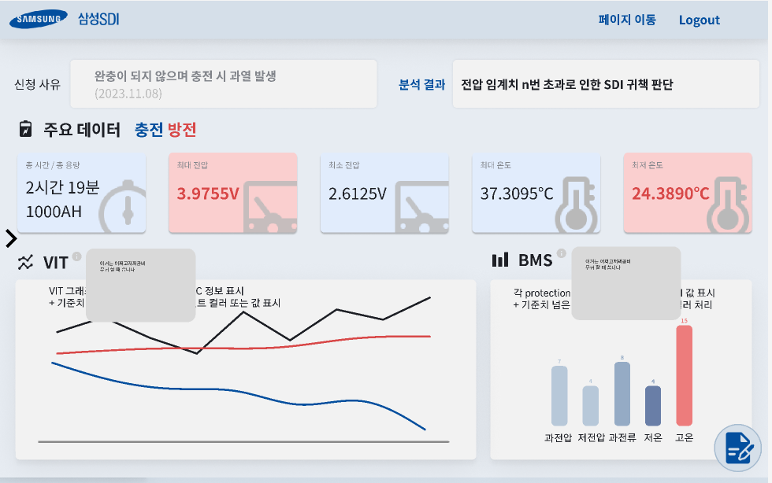
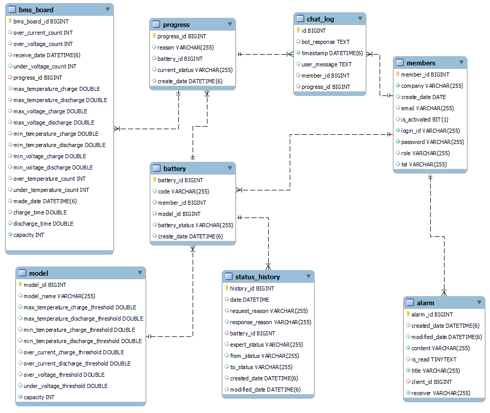

# 🚀 삼성 SDI 기업연계 프로젝트 

 

# 🚀 전지전능 (배터리 전문 RMA 서비스)

 

## 서비스 화면

### 📝 로그인

삼성 SDI의 배터리 고객사와 관리자만이 로그인할 수 있습니다.

### 📹 반송 신청

온라인으로 배터리를 선택하여 반송을 신청할 수 있습니다.

### 👤 반송 결과 확인

자신이 신청한 결과를 간편하게 확인할 수 있습니다.

### 🍱 데이터 분석

삼성SDI의 연구원은 반송 신청된 배터리의 BMS 데이터, VIT 데이터, EKF로 계산한 SOC 데이터를 한눈에 볼 수 있습니다. 
또한 AI를 이용한 1차 분석도 볼 수 있습니다.

### 🎉 반송 처리

이렇게 처리된 데이터를 보고 관리자는 귀책을 판단하여 요청 사항을 처리할 수 있습니다.

### 📝 결과 문서화 자동화, 이메일 전송 자동화

분석이 완료된 반송신청은 데이터와 결과를 자동적으로 보고서화되고, 고객 이메일로 전송되게 됩니다.

 

## 주요 기능

### 프로젝트 기능

- RMA 시스템
  - 고객의 배터리 이름, 모델명 확인
  - 고객은 의심 배터리를 골라 반송 신청
  - 해당 반송 신청 시 Fcm을 통한 Push 알림
  - 고객의 반송처리를 Sidebar에서 확인
  - 고객의 BMS 데이터를 기반으로 OpenAI API를 활용한 분석
  - 고객의 불량 데이터를 확인 후 SDI, 고객사 귀책 판단과 정상 배터리 분석 판단 가능
  - 관리자의 배터리 분석 결과문을 문서화하여 WORD로 변환
  - 관리자의 분석 완료 시, 알림 메시지 전송 및 이메일을 SMTP 프로토콜을 이용하여 전송
- VIT 데이터 처리 및 계산
  - 전류 데이터를 활용한 쿨롱 전류 적산법 사용하여 SOC 잔량 계산
  - 이후 EKF(확장형 칼만 필터) 알고리즘을 이용하여 전압 데이터 활용하여 SOC 처리 고도화
  - 최대, 최소 전압 및 온도 데이터 계산
  - 배터리 모델별 과전압, 저전압, 과전류, 고온도, 저온도 임계치(Protection) 초과 시 count
- 권한 분리하여 고객과 관리자 페이지 관리

### 개발환경

- OS
  - Local : Windows
  - AWS : Ubuntu
- IDE
  - IntelliJ IDE
  - Visual Studio Code
- UI / UX
  - Figma
- DataBase
  - MySQL
  - MongoDB
  - Redis
  - Firebase Realtime Database
- CI/CD
  - Docker
  - nginx
  - Jenkins

### 상세 스택

- BackEnd
  - JAVA 11
  - Gradle
  - SpringBoot 2.7.16, Quarydsl-JPA 5.0.0, Lombok, Swagger3, CertBot
- FrontEnd
  - HTML5, CSS3, JavaScript(ES6)
  - React 18.2.0, React-recoil 0.7.7, React-router-dom 6.16.0
  - axios 1.4.0, Material-UI, bootstrap 5.3.2
  - Node.js, npm, env-cmd 10.1.0
- ETC
  - nginx 1.25.1
  - redis:latest
  - docker

### 협업 툴

- 이슈 관리 : Jira
- 형상 관리 : Gitlab, Git
- 커뮤니케이션 : Notion, MatterMost

### 서비스 아키텍처

### 화면 설계서

### Git 컨벤션

### 1. 커밋 유형 지정

- 커밋 유형은 영어 대문자로 작성하기
    
    
    | 커밋 유형 | 아이콘 | 코드 | 의미 |
    | --- | --- | --- | --- |
    | Feat | ➕ | :heavy_plus_sign: | 새로운 기능 추가 |
    | Fix | 🐛 | :bug: | 버그 수정 |
    | Docs | 📝 | :memo: | 문서 수정 ex) .gitignore, swagger, README |
    | Style | ✨ | :sparkles: | 코드 formatting, 세미콜론 누락, 코드 자체의 변경이 없는 경우 |
    | Test | ✅ | :white_check_mark: | 테스트 코드, 리팩토링 테스트 코드 추가 |
    | Design | 🎨 | :art: | CSS 등 사용자 UI 디자인 변경 |
    | Hotfix | 🔥 | :fire: | 급하게 치명적인 버그를 고쳐야 하는 경우 |
    | Merge | 🔀 | :twisted_rightwards_arrows: | 브랜치 합병하는 경우 |
    | Infra | 🌐 | :globe_with_meridians: | 배포 |

### ERD

### EC2 포트 정리

| 포트 | 내용 |
| ---- | -------------------- |
| 80   | nginx HTTP 기본 포트  |
| 443  | nginx HTTPS          |

